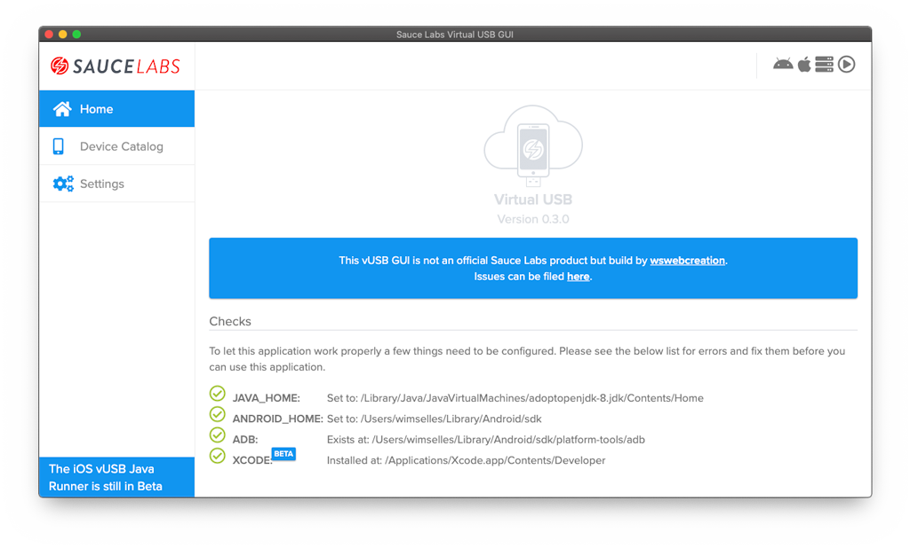
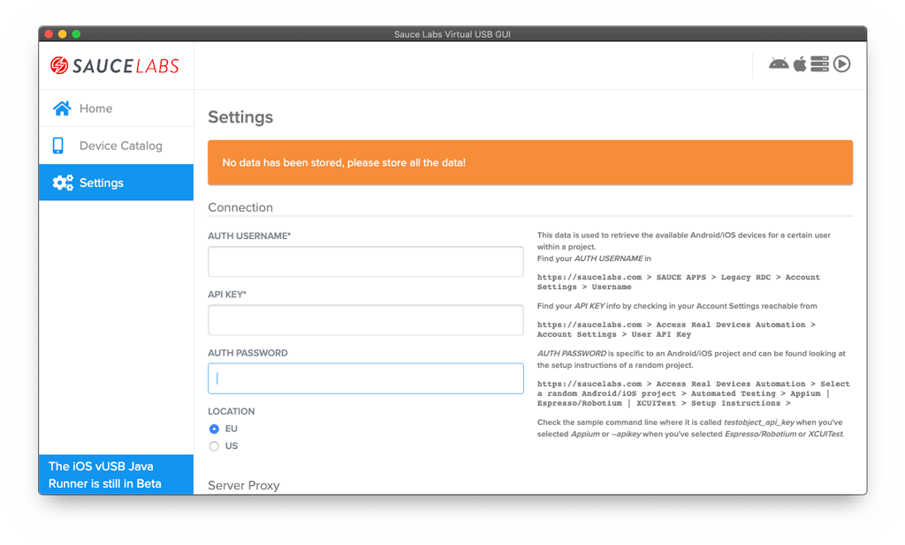
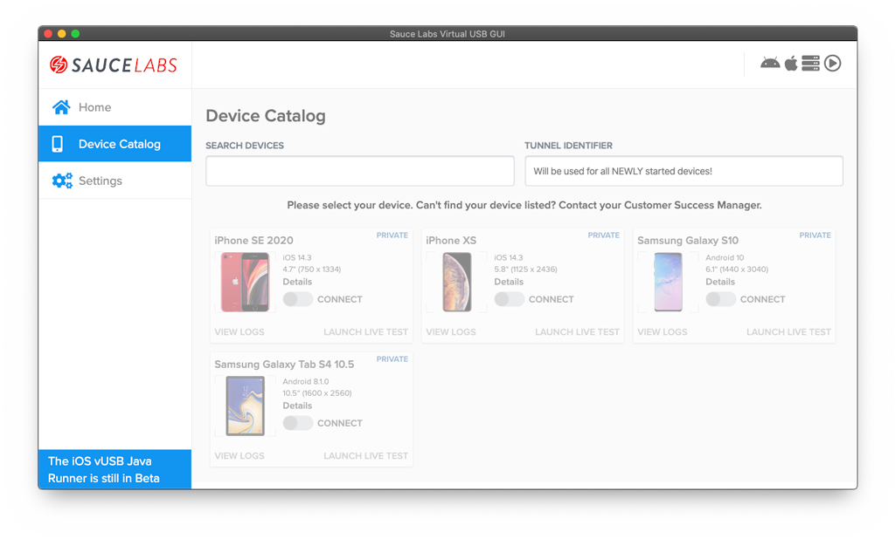
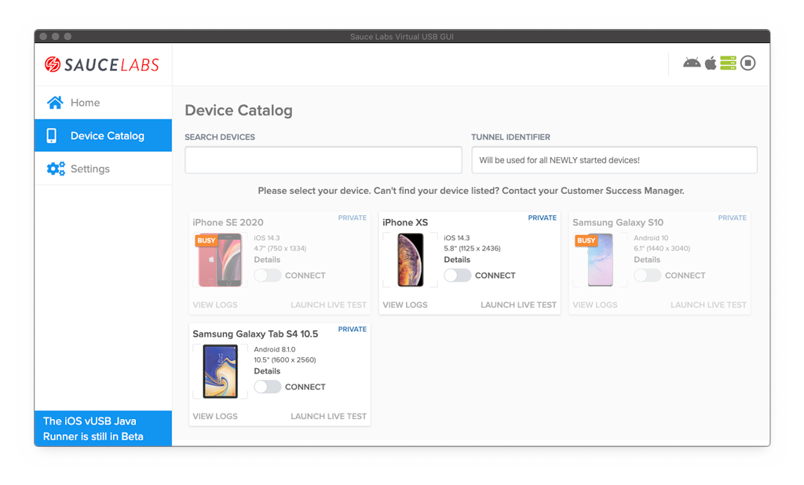
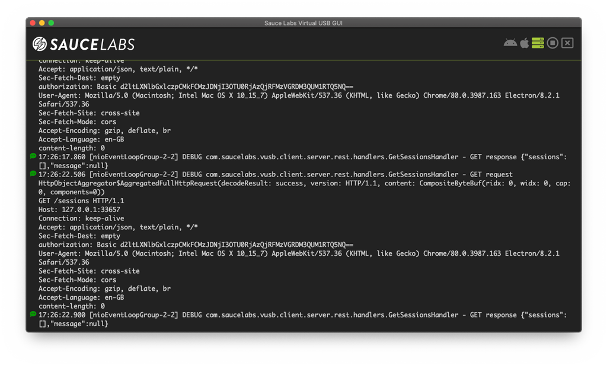
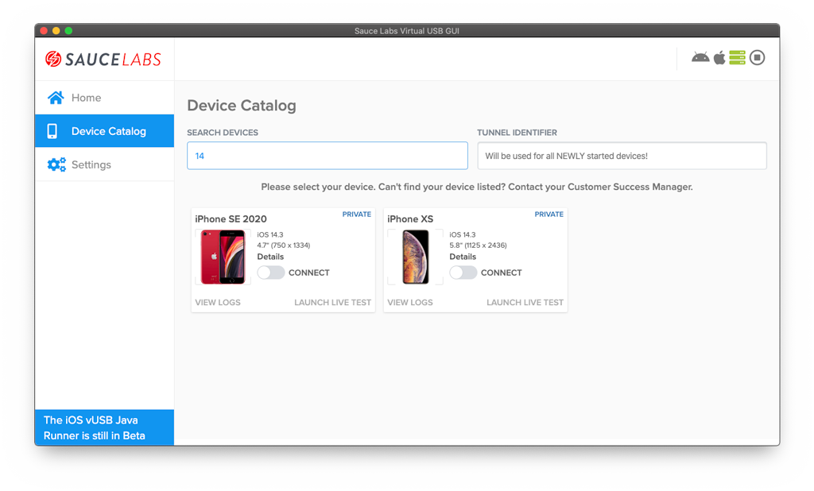
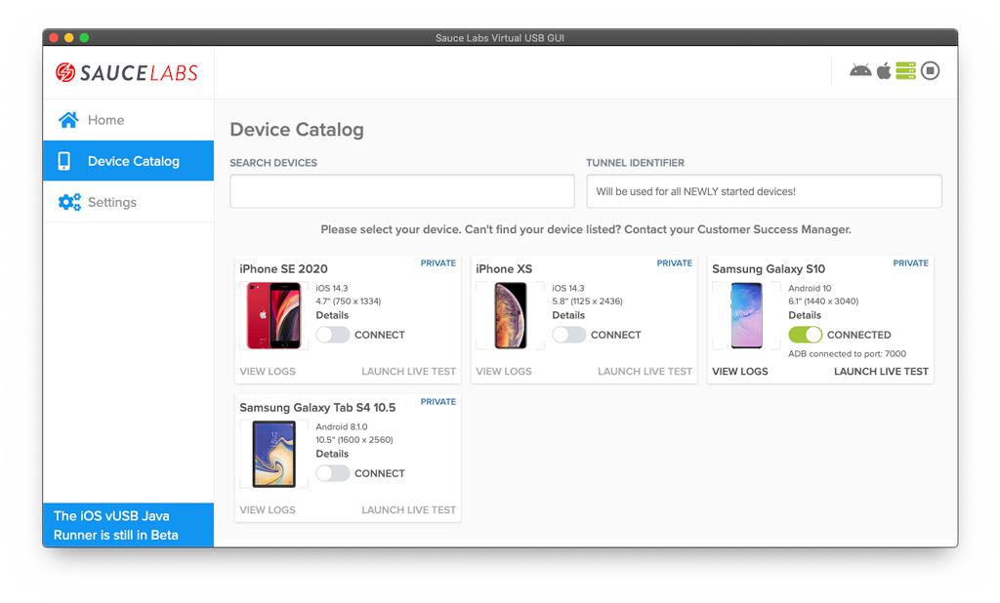
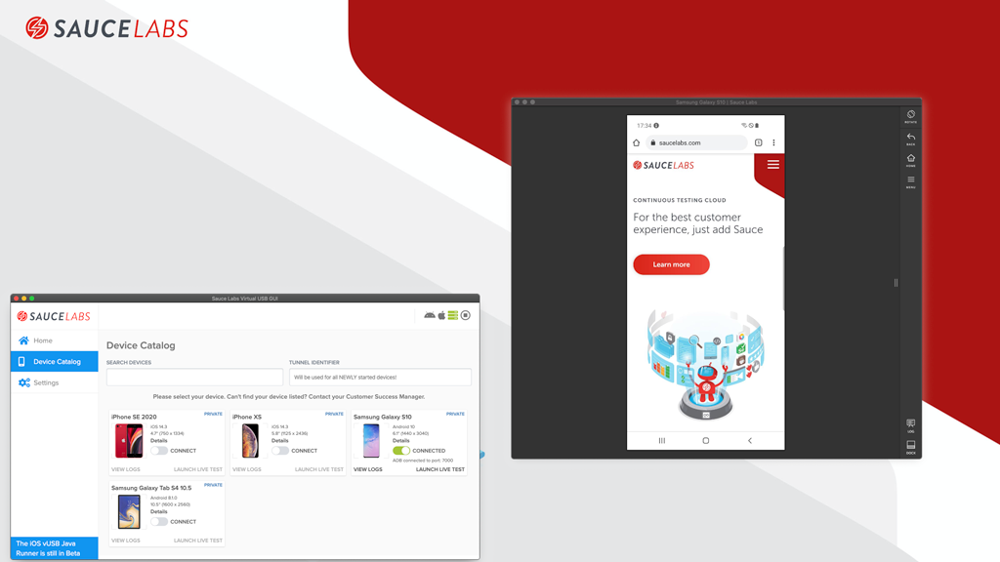
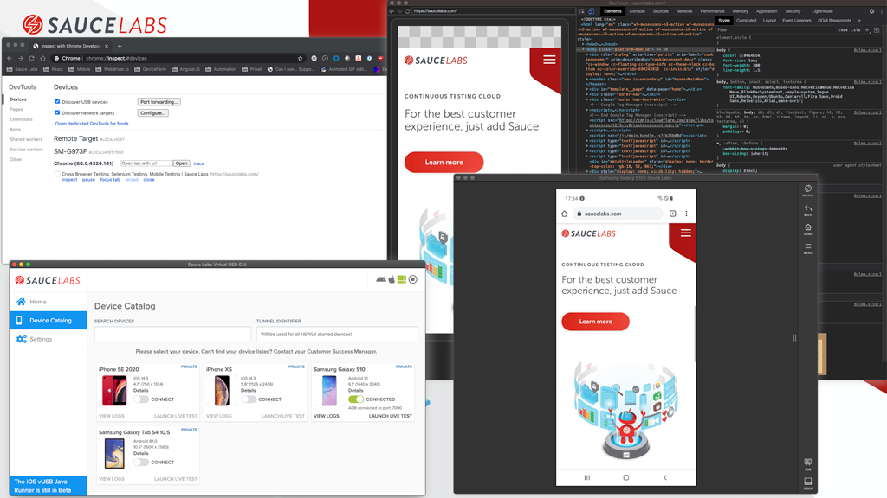
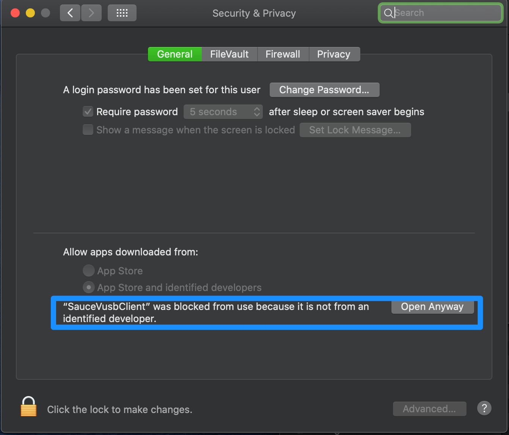

# saucelabs-vusb-gui
This project is an Open Source Virtual USB GUI for Sauce Labs Virtual USB. It provides a simple GUI to start an Android 
or iOS vUSB session with only a few clicks.

> **NOTE:** 
> Sauce Labs Virtual USB will only work if you are having Private devices in your Sauce Labs Real Device cloud

# Table of contents

1. [How to use](#how-to-use)
    - [Prerequisites](#prerequisites)
1. [Features](#features)
    - [Installing](#installing)
1. [TODO](#todo)
1. [Known VUSB GUI issues](#known-vusb-gui-issues)
1. [FAQ](#faq)
1. [Credits](#credits)

> **NOTE:**\
> Please check [FAQ](#faq) for most common issues

## How to use
### Prerequisites Android
To be able to work with Android you need to have the following on your local machine:

- JAVA added to your path
- Latest version of ADB installed on your machine
- (optional) Latest version of Android Studio installed on your local machine

There are enough tutorials on the internet that will explain you how to achieve the above.

### Prerequisites iOS
To be able to work with iOS you need to have a **Mac** and **XCODE** installed.

## Features
- Connect to a **new** VUSB session through the UI
- Change VUSB server settings through the UI
- Automatically connect to ADB
- use older versions of the vUSB runner
- Save logs into files
- Use some most used buttons to control the device from the right menu
- and many more!
 
### Installing
Download the latest version of the client from [here](https://github.com/wswebcreation/saucelabs-vusb-gui/releases).
After you have installed the client check the *Home* screen if there are no environmental issues, see below, 
if you have them please fix them and restart the app.

Then go to *Settings* and fill the needed data. The first time you will see a screen like below

You can adjust the server settings by scrolling down.

> **NOTE**\
> Check all the settings to see what you this Sauce Labs Virtual USB GUI can do for you!

When all *Settings* have been stored the *Device Catalog* can be used (if you didn't store the data properly clicking on 
the *Device Catalog* will automatically bring you back to the *Settings*).
You will see a screen like this.

You can't select a device because you first need to start the server, this can be done by clicking on the play-button. 
The screen will update and look like this.

.

To see the logs of the server click on the green icon, the logs can also be cleared like you normally would do with a terminal. 
The monitor can be closed by clicking on the cross.

You can easily search devices. Each word will be seen as an argument and the device needs to match all arguments.

Connect to a device by clicking on the switch. After a few minutes the switch will change from `Connecting` to `Connected`,
see below.

When you now click on *LAUNCH LIVE TEST* a new window will be opened and a new fresh VUSB session will be started.

The device needs to be connected to ADB to use the full power of Sauce Labs Virtual USB. You can do that automatically, 
Go to `Settings > AUTOMATICALLY CONNECT TO ADB`, or follow he steps below.

If you want to manually connect the device to your local machine then take the port number that is shown in the GUI and 
connect it with ADB like you normally would do.
In this case the device needs to be connected to port `7001` which leads to this command 

    adb connect localhost:7000

This will give you the opportunity to connect the device to for example Chrome and debug the website like this.

 

## Known vUSB GUI issues
- When you close a Live Testing session the VUSB session is also closed.

## FAQ
### I'm not seeing any devices in the device catalog
Please make sure you have private devices assigned to your account. If you still can't see them file an issue 
[here](https://github.com/wswebcreation/saucelabs-vusb-gui/issues).

### Why can't I see iOS devices, even though I have private iOS devices assigned to my account
Virtual USB for iOS is in an early access mode. This app doesn't support that yet. Please contact your Sauce Labs Customer 
Success Manager to learn more about VUSB for iOS.

### I'm getting al kinds of errors in my home screen telling me that `JAVA_HOME`, `ANDROID_HOME` and or `ADB` are not working
Make sure you have set up your environment for using Android on your local machine. Use Google as your biggest friend.

### Is this product build and maintained by Sauce Labs?
No, this product is build by myself because I wanted to learn building Apps with Electron and ReactJS. I thought that a 
simple UI for the Sauce Labs VUSB solution would be a nice project to start with.

### Why is the source code not provided
The source code will be provided in a few months.

### Cannot open Sauce vUSB app because it's "malicious software"
When trying to open the application, you might get an error from Mac saying that you can't open this software because it's 
downloaded from an external source and could be malicious software.

You can fix this by going to `System Preferences > Security & Privacy` and click on `Open Anyway`, see below

 

You may still fail opening Sauce vUSB on Big Sur after the previous step. You may have to open a terminal and with the sudo command run the following command:

     xattr -rd com.apple.quarantine /Applications/SauceVusbClient.app 

Once done, this should let you open the Sauce vUSB GUI without any further issues.

### XCODE/Safari doesn't recognise my just connected iOS device over vUSB
You'll need to exit Xcode/Safari before connecting to an iOS Virtual USB session (or relaunch it after connecting). 
Otherwise, the device won't show up.

## Credits
This app has been build with [electron-react-boilerplate](https://github.com/electron-react-boilerplate/electron-react-boilerplate).
