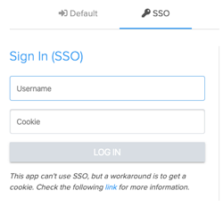
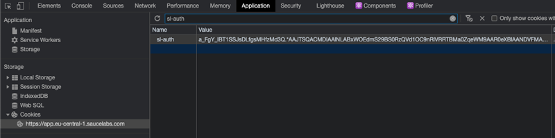
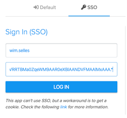

# vUSB GUI and SSO
Signing in with vUSB version `1.0.0` is now mandatory. This can be done with your Sauce Labs `username` and `password`
as you would normally do when you [sign in to the Sauce Labs cloud](https://accounts.saucelabs.com). There is only one 
challenge, you don't sign in with a `username` and `password` when you use SSO within your organisation. Luckily there 
is a workaround which is explained below.

## SSO workaround
When you sign in with or your `username`/`password` or SSO-link, Sauce Labs will set a cookie which is called the 
`sl-auth`-cookie. The workaround is to copy the cookie from Sauce Labs and fill it in the `cookie` field. Please follow 
the following steps to use SSO with vUSB. 

> NOTE 1: The cookie can only be used for 30 minutes. If the session you have open with the vUSB GUI is longer than 30 
> minutes you will get an error when trying to retrieve the devices. You can click on `Log out` and repeat the steps.
> If that doesn't work then close the vUSB GUI and restart it.

> NOTE 2: The steps below use Chrome as an example, but this will work with whatever your favourite browser is.

1. Open a browser and Sign in to Sauce Labs with SSO
1. When you are signed in, go to **Account** > **User Settings** and copy the `username` and fill it in the SSO-`username` 
   field. (*This value will automatically be stored for future sign in sessions.*)

   

1. Now open [DevTools](https://developers.google.com/web/tools/chrome-devtools/open) in your browser.
1. Go to the `Application`, this is where you can find all the `Local|Session|Cookie`-storage
1. Open the `Cookies`-dropdown on the left as shown in the below image
   
    

1. In the search-bar enter the value `sl-auth`. The cookies will be filtered and the `sl-auth`-cookie will be shown as 
   seen below

    

1. Copy the value and paste it into the SSO Sign in form in the `cookie`-field as seen below

    

1. Click on `LOG IN` and you should be logged in. If not  then please repeat the steps.
